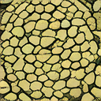
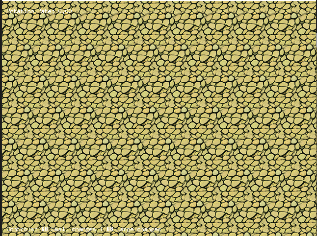
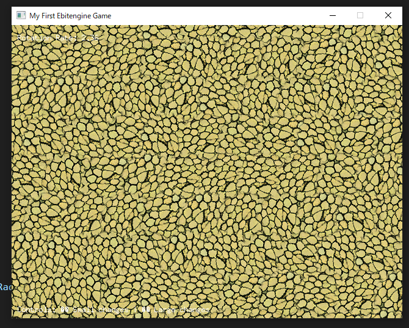

# テクスチャのレンダリング

- 1枚のテクスチャをいい感じに配置することで、繰り返しパターンの違和感を無くす

## 操作方法

- ↑↓←→ キーでテクスチャの回転角の変更

## 元のテクスチャ
Stable Diffutionで生成したテクスチャ画像



```bash
python "tools\SD_request.py" --positive "top-down view of fine gravel texture, tiny pebbles, micro stones, detailed granular surface, small grain size, high resolution detail, seamless tileable texture, game asset, photorealistic" --negative "blur, distortion, text, watermark, large stones, rocks, pebbles larger than 5mm" --width 128 --height 128 --output "game_01\assets\textures" --filename "fine_gravel_texture" --cfg_scale 8 --steps 40
```

## 単純なタイリング


## いい感じに回転させる


## アルゴリズム
- テクスチャにアルファを乗せて周囲をぼかす
- テクスチャをランダムに回転させて張り付ける
- 奇数行目のテクスチャを半キャラ分ずらす
- 上下左右キーで、回転角度の変化