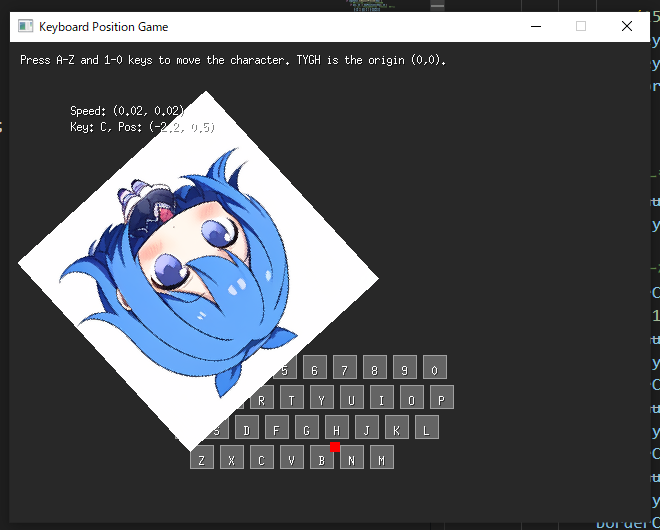

# Game 02

## キーボードの押された位置にキャラクターが移動する



## スプライト生成


```bash
python SD_request.py --positive "top-down view of a cute anime girl character, looking from above, perfect for a 2D game sprite, chibi style, full body visible, white background, game asset" --negative "bad anatomy, bad proportions, blurry, low quality, text, watermark" --width 256 --height 256 --output "../game_02/assets/images" --auto-start
```